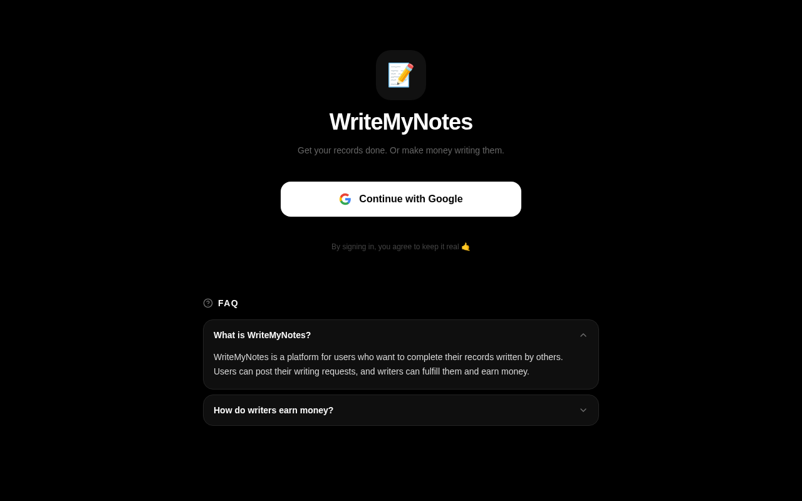

# WriteMyNotes

WriteMyNotes is a college-focused freelance marketplace that connects students who need handwritten records, assignments, and notes with students willing to write and deliver them physically within the same campus.

The platform is designed to make academic outsourcing faster, simpler, and more reliable without depending on chaotic WhatsApp groups or middlemen.

## Screenshots

  

## Live Platform

### Official Website
https://writemynotes1.vercel.app

## What WriteMyNotes Does

- Allows students to post handwritten work requirements
- Connects writers directly with requesters
- Supports physical in-campus delivery
- Enables direct payment through UPI or cash
- Creates earning opportunities for students

## How It Works

### 1. Post a Request
Students submit:
- subject
- topic
- page count
- deadline
- budget

### 2. Writers Respond
Interested student writers contact the requester directly.

### 3. Delivery & Payment
The writer completes the handwritten work and delivers it physically. Payment is handled directly between students.

## Core Features

- Student-to-student marketplace
- Live request posting
- Physical handwritten delivery
- Direct communication
- UPI / cash payments
- Zero platform commission
- Mobile responsive interface

## Why WriteMyNotes?

### Better Than WhatsApp Groups
Structured and searchable instead of scattered chat messages.

### Campus-Focused
Built for students within the same college environment.

### Faster Turnaround
Designed for urgent academic deadlines and last-minute submissions.

### No Platform Fees
Students negotiate directly without commissions or hidden charges.

## Technology Stack

### Frontend
- React
- TypeScript
- TailwindCSS
- Vite

### Backend & Database
- Supabase
- PostgreSQL

### Deployment
- Vercel

## Vision

To build a trusted student-powered ecosystem where academic tasks can be outsourced efficiently while helping students earn within their own campus community.

## Future Improvements

- Writer ratings & reputation system
- Secure in-app messaging
- Escrow payment system
- AI-based matching for requests
- Campus verification system
- Mobile application

## Author

Irfan Ahmed

GitHub  
https://github.com/irfanahmed0019
